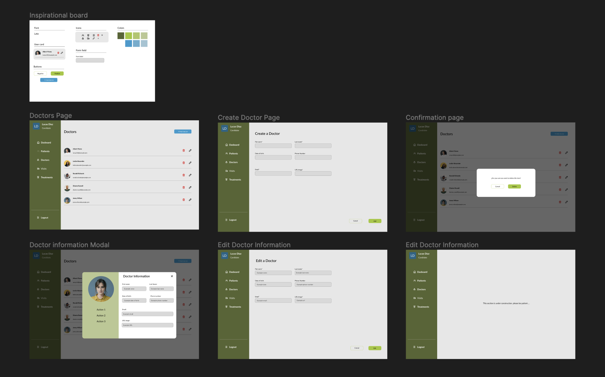

# CRUD App for Careexpand's interview

This is a simple CRUD example created in order to showcase knowledge related to frontend development using React, a couple of libraries & the use of Figma. This app was made using the boundler -> Vite, with: 

- React-TS 
- React-redux
- Redux Toolkit 
- Tailwind 
- Json-server 

## Figma 

Here is the link to Figma and its prototype: 
- https://www.figma.com/file/sxW2yznrFTMdQeZbbpOZ1D/CRUD-Interview-Careexpand?type=design&node-id=0%3A1&mode=dev&t=bZ3JPv4Z4k691sTC-1

And its's wireframe: 

- https://www.figma.com/proto/sxW2yznrFTMdQeZbbpOZ1D/CRUD-Interview-Careexpand?type=design&node-id=0-1&t=bZ3JPv4Z4k691sTC-0&scaling=scale-down&page-id=0%3A1&starting-point-node-id=15%3A19&prev-org-id=external-teams

## Use Cases

In this app, only "Doctors" section is available. There, you can: 

- list all doctors with pagination included
- create a doctor
- update a doctor
- delete a doctor 
- see full detail of a doctor in a modal

## Instructions 

__important!!__ -> In order to run the project, __VITE must be installed__ in the computer.

First, you'll have to clone this repository into local and execute the next instructions in a terminal: 

To install all the dependencies:
- __npm i__ 

To build and run the backend (this tag will remain open/listening) : 
- __npm run server__ 

To run the project locally (this tag will remain open/listening): 
- __npm run dev__

P.S: If you create a doctor and click over the full name or the pic, a modal will apear to show more information related to the doctor. 

I hope you enjoy this tiny App 😃